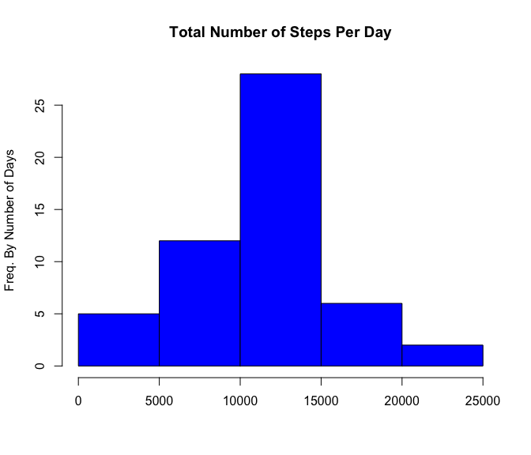
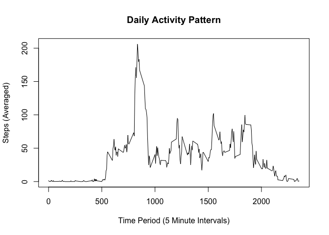
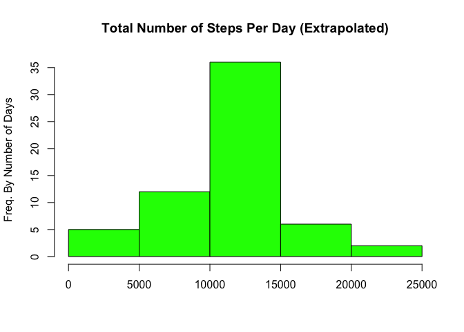
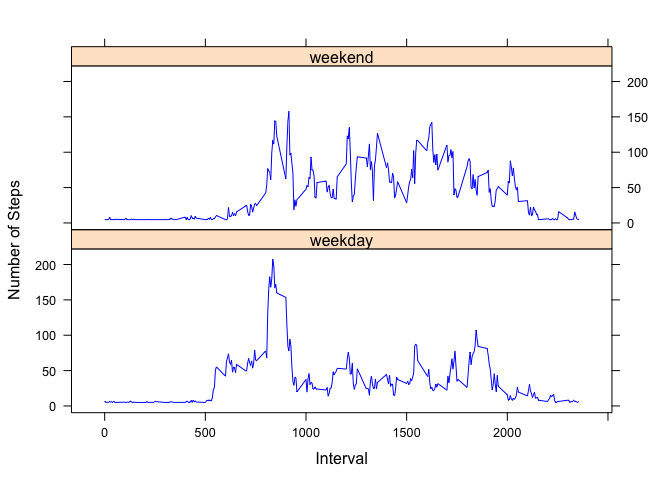

# Reproducible Research: Peer Assessment 1


## Loading and preprocessing the data

```r
  if(!file.exists('activity.csv')){
      unzip('activity.zip')
  }
  activity <- read.csv('activity.csv')
  
  # tapply and remove the NAs from the calculations
  totalSteps <- tapply(activity$steps, activity$date, FUN=sum)

summary(totalSteps)
```

```
##    Min. 1st Qu.  Median    Mean 3rd Qu.    Max.    NA's 
##      41    8841   10760   10770   13290   21190       8
```

## What is mean total number of steps taken per day?


```r
  # Historgram
  hist(totalSteps, main = "Total Number of Steps Per Day", xlab = "", ylab = "Freq. By Number of Days", col = "blue")
```

 

```r
  # Calc the mean from the totalSteps, set na.rm=TRUE because I left them in 
  meanTotSteps <- round(mean(totalSteps, na.rm=TRUE), 2)
  
  # Now the median
  medianTotSteps <- round(mean(totalSteps, na.rm=TRUE), 2)
```

The mean is **10766.19** and the median is **10766.19** for the number of steps.

## What is the average daily activity pattern?


```r
  # Calc the mean steps for each interval with aggregate, removing the NAs, and shaping the data.
  dailyActivityPattern <- aggregate(x = list(meanSteps = activity$steps), 
                                    by = list(interval = activity$interval), 
                                    FUN=mean, na.rm=TRUE)
  
  # Plot the daily activity
  plot(dailyActivityPattern$interval, dailyActivityPattern$meanSteps, 
       type = "l", 
       xlab = "Time Period (5 Minute Intervals)", 
       ylab = "Steps (Averaged)", main = "Daily Activity Pattern")
```

 

```r
  # Which interval has the maxium average number of steps? 
  dailyMax <- dailyActivityPattern[which.max(dailyActivityPattern$meanSteps),]
```
Interval **835** has the maximum number of steps at **206** steps.

## Imputing missing values


```r
  # Calculate and report the total number of missing values in the dataset
  totalMissing <- sum(is.na(activity$steps))
  
  # Fill in the missing values based on 5-minute interval averages
  
  # Copy the activity data
  activityExtrapolated <- activity
  activityExtrapolated$steps <- with(activityExtrapolated, impute(steps, mean))

  # Make a histogram of the total number of steps taken each day and Calculate and report the mean and median total number of steps taken per day
  
  totalStepsExtrapolated <- tapply(activityExtrapolated$steps, activity$date, FUN=sum)
  # Historgram
  hist(totalStepsExtrapolated, main = "Total Number of Steps Per Day (Extrapolated)", 
       xlab = "", 
       ylab = "Freq. By Number of Days", 
       col = "green")
```

 

```r
  # Calc the mean from the totalStepsExtrapolated
  totalStepsExtrapolatedMean <- round(mean(totalStepsExtrapolated), 2)
  # Now the median
  totalStepsExtrapolatedMedian <- round(median(totalStepsExtrapolated), 2)
```

The mean is **10766.19** and the median is **10766.19** total number of steps taken per day with the extrapolated data.

Do these values differ from the estimates from the first part of the assignment? 

Given that the mean from the first part **10766.19** and the median **10766.19** are the same out to two digits as the extrapolated data, the values do not differ significantly. 

What is the impact of imputing missing data on the estimates of the total daily number of steps?

Missing **2304** values didn't seem to impact the estimates.


## Are there differences in activity patterns between weekdays and weekends?


```r
  # Weekday or weekend function
  dayType <- function(date) {
    if (weekdays(date) %in% c('Saturday', 'Sunday')) {
      return('weekend')
    } else {
      return('weekday')
    }
  }
  
  # Create a new column, dateTime, from the date and interval columns.
  time <- formatC(activityExtrapolated$interval / 100, 2, format='f')
  # Add the new column. Why GMT? Unless the TZ was stated, GMT is a safe default.
  activityExtrapolated$dateTime <- as.POSIXct(paste(activityExtrapolated$date, time), format='%Y-%m-%d %H.%M', tz='GMT')
  
  dayTypes <- sapply(activityExtrapolated$dateTime, dayType)
  activityExtrapolated$dayType <- as.factor(dayTypes)
  
  # Break down the data into two groups, weekday or weekend, and average the steps
  activityByDayType <- aggregate(activityExtrapolated$steps, by = list(activityExtrapolated$interval, activityExtrapolated$dayType), 
                                 FUN = "mean", na.rm = TRUE)
  # Add column names to make it easier to use
  colnames(activityByDayType) <- c("interval", "dayType", "steps")
  
  # Plot the data to two different plots, one for weekdays, the other weekends
  xyplot(activityByDayType$steps ~ as.numeric(activityByDayType$interval) | activityByDayType$dayType, data = activityByDayType, 
         type = "l", layout = c(1, 2), col = c("blue"), 
         xlab = "Interval", ylab = "Number of Steps")
```

 

Given the graph output, the weekend overall shows more activity in the mid-morning until the evening than the weekday acivity.
